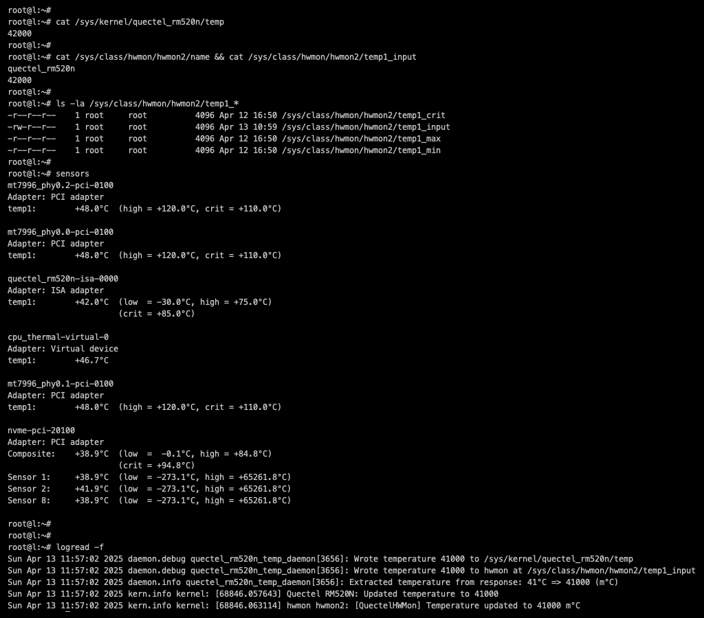

# Quectel RM520N Thermal Management Tools

## Overview

This project provides a set of tools and kernel modules for managing the temperature of the Quectel RM520N modem. It is designed as an OpenWRT package and can be integrated into custom OpenWRT builds (compatible with OpenWRT 23.05, 24.10 and newer versions). The package includes support for dynamic Device Tree Overlays (DTO), a configurable daemon, and various kernel modules for thermal management.

## Features

- **OpenWRT Integration**: Fully compatible with OpenWRT build systems for seamless integration into custom firmware builds.
- **Dynamic Device Tree Overlays (DTO)**: Supports dynamic registration of virtual sensors via DTOs.
- **Configurable Daemon**: A userspace daemon reads modem temperature via AT commands and updates sysfs, virtual sensors, and hwmon nodes.
- **Kernel Modules**: Includes kernel modules for sysfs-based temperature reporting, hwmon integration, and virtual thermal sensors.
- **Fallback Mechanisms**: Provides fallback options when Device Tree overlay is not supported.
- **Open Source**: Licensed under the GNU General Public License v2 for maximum flexibility.

## Components

1. **Kernel Modules**:
   - `quectel_rm520n_temp`: Provides a sysfs interface for temperature reporting.
   - `quectel_rm520n_temp_sensor`: Registers a virtual thermal sensor via the Linux Thermal Framework.
   - `quectel_rm520n_temp_sensor_hwmon`: Integrates with the hwmon subsystem for hardware monitoring.

2. **Userspace Daemon**:
   - `quectel_rm520n_temp_daemon`: Reads temperature via AT commands and updates sysfs, hwmon, and virtual sensors.

3. **Device Tree Overlay**:
   - A DTO file (`quectel_rm520n_temp_sensor.dtbo`) for dynamic sensor registration.

4. **Configuration**:
   - Configurable via UCI (`/etc/config/quectel_rm520n_thermal`).

## Installation

### Prerequisites

- OpenWRT build environment set up.
- Kernel headers for your target platform.

### Building the Package

1. Clone this repository into your OpenWRT package directory:

   ```bash
   git clone https://github.com/your-repo/quectel-rm520n-thermal.git package/quectel_rm520n-thermal
   ```

2. Add the package to your build configuration:

   ```bash
   make menuconfig
   ```

   Navigate to `Utilities` and select `Quectel RM520N Thermal Management Tools`.

3. Build the firmware:

   ```bash
   make
   ```

4. Flash the firmware to your device.

### Installing on an Existing System

If OpenWRT is already installed, you can build and install the package manually:

```bash
make package/quectel-rm520n-thermal/compile V=s
opkg install bin/packages/.../quectel-rm520n-thermal.ipk
```

### Note on Automatic Service Registration

The package automatically registers the daemon as a service, starts it after installation, and enables it for autostart. No additional steps are required to manually activate the daemon.

## Configuration

### UCI Configuration

Edit the configuration file at `/etc/config/quectel_rm520n_thermal`:

```ini
config quectel_rm520n_thermal 'settings'
    option serial_port '/dev/ttyUSB3'
    option interval '10'
    option baud_rate '115200'
    option temp_prefix 'modem-ambient-usr'
    option error_value 'N/A'
    option dt_overlay_support '1'
    option fallback_register '1'
    option debug '0'
```

- `serial_port`: Serial port for AT communication.
- `interval`: Polling interval in seconds.
- `baud_rate`: Baud rate for the serial connection.
- `temp_prefix`: Prefix for temperature values in AT responses.
- `error_value`: Value to write in case of errors.
- `dt_overlay_support`: Enable (1) or disable (0) Device Tree overlay support (for OpenWRT version compatibility).
- `fallback_register`: Enable (1) or disable (0) fallback module registration when Device Tree is not available.
- `debug`: Enable (1) or disable (0) additional debug output.

### OpenWRT Version Compatibility

This package includes several features to ensure compatibility across different OpenWRT versions:

1. **OpenWRT 23.05 Compatibility**:
   - Uses stable kernel APIs available in Linux 5.15
   - Provides fallback mechanisms when Device Tree overlay is not supported
   - Includes workarounds for older hwmon and thermal subsystem interfaces

2. **OpenWRT 24.10+ Compatibility**:
   - Takes advantage of newer kernel features in Linux 6.6
   - Supports both Device Tree overlay and direct module loading
   - Compatible with modern thermal and hwmon subsystem interfaces

The configuration options `dt_overlay_support` and `fallback_register` allow fine-tuning the behavior for different OpenWRT versions and hardware platforms.

### Starting the Daemon

Enable and start the daemon:

```bash
/etc/init.d/quectel_rm520n_thermal enable
/etc/init.d/quectel_rm520n_thermal start
```

## Usage

- **Sysfs Interface**: Access temperature via `/sys/kernel/quectel_rm520n/temp`.
- **Virtual Sensor**: Update and monitor temperature via `/sys/devices/platform/quectel_rm520n_temp-sensor@0/cur_temp`.
- **Hwmon Integration**: Check `/sys/class/hwmon/hwmonX/temp1_input` for temperature values.

## Screenshot

Below is a screenshot showcasing the thermal management tools in action:



## Tip: Finding the hwmon Interface by Name

To easily locate the hwmon interface for the Quectel RM520N, you can use the following command:

```bash
for hwmon in /sys/class/hwmon/*; do \
  if [ "$(cat $hwmon/name)" = "quectel_rm520n" ]; then \
    echo "Found hwmon interface: $hwmon"; \
  fi; \
done
```

This script iterates through all hwmon entries and checks their `name` attribute for `quectel_rm520n`. Once found, it prints the path to the corresponding hwmon interface.

## Device Tree Integration

This package supports integration with Device Tree at image compilation time:

1. **Example DTS File**: 
   - An example DTS file is provided at the root of the project (`quectel_rm520n_temp_sensor_overlay.dts.example`)
   - This file can be used as a reference when creating custom Device Tree overlays during image generation

2. **No Runtime DTS Compilation**: 
   - The package does not attempt to compile or load Device Tree overlays at runtime
   - All Device Tree integration should be handled during the OpenWRT image build process

3. **Module Loading Fallback**:
   - The init script will load kernel modules directly as a fallback mechanism
   - This behavior can be controlled with the `fallback_register` UCI option

### Integration with OpenWRT Build System

To integrate the DTS file with your OpenWRT build:

1. Copy the example DTS file to your target board's DTS directory
2. Include it in your board's DTS configuration
3. The OpenWRT build system will compile it as part of the image generation process

This approach keeps the package lightweight while allowing flexible Device Tree integration for different hardware platforms.

## License

This project is licensed under the GNU General Public License v2. See the `LICENSE` file for details.

## Contributing

Contributions are welcome! Please open an issue or submit a pull request on GitHub.

## Support

For questions or support, please contact the maintainer or open an issue on GitHub.
